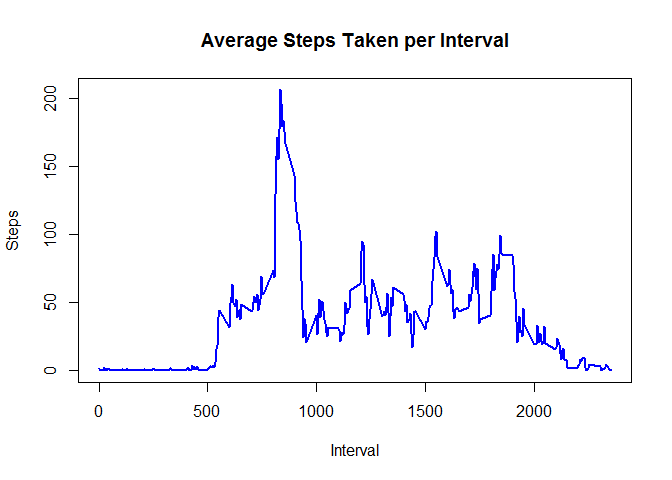

# Reproducible Research: Peer Assessment 1
Phil Bagienski  

## Loading and preprocessing the data
Download, unzip, and read the data file.

```r
download.file("https://d396qusza40orc.cloudfront.net/repdata%2Fdata%2Factivity.zip", 
        "datafile.zip")
unzip("datafile.zip")
data <- read.csv("activity.csv")
```
Preprocessing: Turn dates into Date format

```r
data$date <- as.Date(data$date, "%Y-%m-%d")
```


## What is mean total number of steps taken per day?
Calculate total number of steps taken per day and display as histogram.

```r
dayTotals <- aggregate(steps~date, data=data, FUN=sum)
plot(steps~date, data=dayTotals, type="h", xlab="Date", ylab="Total Steps Taken",
       main="Total Steps per Day in 2012", lwd=5, col=3)
```

<!-- -->

Calculate the mean and median number of steps per day.

```r
meanSteps=mean(dayTotals$steps)
medianSteps=median(dayTotals$steps)
```
The mean total number of steps per day is 1.0766189\times 10^{4}
The median number steps of per day is 10765

## What is the average daily activity pattern?
Average the number of steps per each interval and display as a time series plot.

```r
intMeans <- aggregate(steps~interval, data=data, FUN=mean)
plot(steps~interval, data=intMeans, type="l", xlab="Interval", ylab="Steps",
    main="Average Steps Taken per Interval", lwd=2, col=4)
```

<!-- -->

Find the 5-minute interval containing the maximum number of steps.

```r
max <- intMeans[which.max(intMeans$steps),1]
```
The interval containing the max number of steps is 835


## Imputing missing values
Calculate the total number of missing values in the dataset.

```r
missing <- sum(is.na(data$steps))
```
There are 2304 missing values in this dataset.

Replace these missing values with the mean for each 5 minute interval.

```r
fixedData <- data
naIndex <- which(is.na(fixedData$steps))
meansData <- mergedMeans<-merge(fixedData, intMeans, by="interval", 
        suffixes=c(".actual", ".average"))
fixedData[naIndex,"steps"] <- meansData[naIndex,"steps.average"]
```

Using this "fixed" data, make a histogram of the total number of steps taken each day.  

```r
newdayTotals <- aggregate(steps~date, data=fixedData, FUN=sum)
plot(steps~date, data=newdayTotals, type="h", xlab="Date", ylab="Total Steps Taken",
    main="Total Steps per Day in 2012, NA's adjusted", lwd=5, col=3)
```

<!-- -->


Calculate the mean and median number of steps per day.

```r
newmeanSteps <- mean(newdayTotals$steps)
newmedianSteps <- median(newdayTotals$steps)
```
The mean after imputing missing values as the mean steps of its corresponding interval 
is 1.0889799\times 10^{4}. The median is 1.1015\times 10^{4}. This is different from the 
previous two values, as both have increased.

## Are there differences in activity patterns between weekdays and weekends?
Create a new factor variable in the dataset with two levels - "weekday" and "weekend" 
indicating whether a given date is a weekday or weekend day.

```r
weekdata <- fixedData
weekdata$day <- weekdays(weekdata$date)
for (i in 1:nrow(weekdata)) {
        if (weekdata$day[i] == "Saturday" | weekdata$day[i] == "Sunday") {
                weekdata$type[i] = "weekend"
        } else {
                weekdata$type[i] = "weekday"
    }
}
```

Make a panel plot containing a time series plot (i.e. type = "l") of the 5-minute interval (x-axis) and the average number of steps taken, averaged across all weekday days or weekend days (y-axis).

```r
library(ggplot2)
weekMeans <- aggregate(steps~interval*type, data=weekdata, FUN=mean)
weekMeans$type <- as.factor(weekMeans$type)
ggplot(weekMeans, aes(interval, steps)) + geom_line() + facet_grid(type~ .) +
         xlab("5-minute interval") + ylab("Number of Steps") + ggtitle("Activity Patterns between Weekdays and Weekends")
```

<!-- -->
